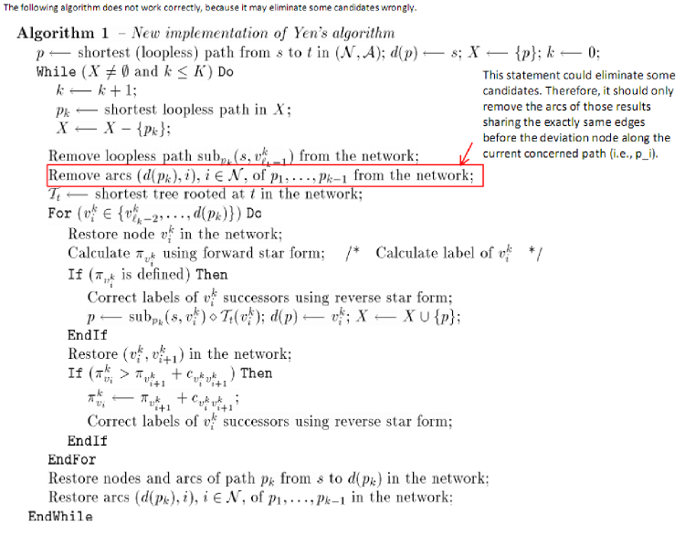

# An implementation of K-Shortest Path Algorithm (Java Version)

The description of the original algorithm could be found in the paper, 'A New Implementation Of Yen's Ranking Loopless Paths Algorithm' (http://citeseer.ist.psu.edu/martins00new.html).

##Introduction
Yen’s algorithm is one of derivation algorithms for ranking the K shortest paths between a pair of nodes[1]. It always searches the shortest paths in a “pseudo”-tree containing K shortest loopless paths. The very shortest one is obtained in the first place, and the second shortest path is always explored on the basis of the shortest paths that are shorter. In our paper, we exploit the implementation of Yen’s algorithm in [1]. Compared with the straightforward implementation of Yen’s algorithm, the one present in [1] is proved to have a better performance in computational experiments, although the complexity of them are the same, O(Kn(m+nlogn)) in the worst case analysis.

##Implementation

The package contains the implementation of Yen's algorithm for top-k shortest paths in a directed weighted graph. 

Note that:
1. It's implemented in Java. (The version is 2.3)
2. In order to compile the source code, JRE version in your machine must be 1.5+. 
3. The way to use the package is shown in the testing case (edu.asu.emit.algorithm.graph.test.*).

##Update

* A checking is added in the C++ implementation to make sure the number of vertices in the input file is correct. 
* The C++ version of the algorithm is ready for downloading. This implementation follows the similar design as its [Java counterpart]().* A bug is fixed in the Java implementation. The algorithm presented in Reference [1] is not always right. Specifically, the test case with the graph (see 'test_6_1' in the source package) can not return all results if the algorithm is applied. 
* A fix on the comparator associated with Class QYDirectedPath is provided for the CPP implementation. Thanks a lot to timothyahahn. 
* The implementation of top-k shortest path algorithm in *C#* by Vinh Bui (vinhqb@gmail.com) is added. Note that I won't test this code completely. 

##Reference

[1]: M. Pascoal and E. Martins. A new implementation of Yen’s ranking loopless paths algorithm. 4OR – Quarterly Journal of the Belgian, French and Italian Operations Research Societies, 2003.

[2]: A Fortran implementation: http://www.mat.uc.pt/~eqvm/OPP/KSPP/KSPP.html.


## A Tutorial

In the latest version of Java implementation, we allow to obtain shortest paths in two ways.

### Batch Computation ###

In the batch mode, the user can set the number of shortest paths that he/she wants, and all results can be obtained at a time.

For example:
```
Graph graph = new VariableGraph("data/test_7");
YenTopKShortestPathsAlg yenAlg = new YenTopKShortestPathsAlg(graph);
List<Path> shortest_paths_list = yenAlg.get_shortest_paths(
		graph.get_vertex(0), graph.get_vertex(2), 100);
```
### Obtain by Iteration ###

In this mode, the user can access paths between any pair of nodes in the graph, in increasing order.

```
Graph graph = new VariableGraph("data/test_7");
YenTopKShortestPathsAlg yenAlg = new YenTopKShortestPathsAlg(
		graph, graph.get_vertex(0), graph.get_vertex(2));
while(yenAlg.has_next())
{
   Path cur_result = yenAlg.next();
   ...
}
```

##A Note about A Bug

The algorithm presented in the paper "A new implementation of Yen’s ranking loopless paths algorithm", is not correct in all graphs.

